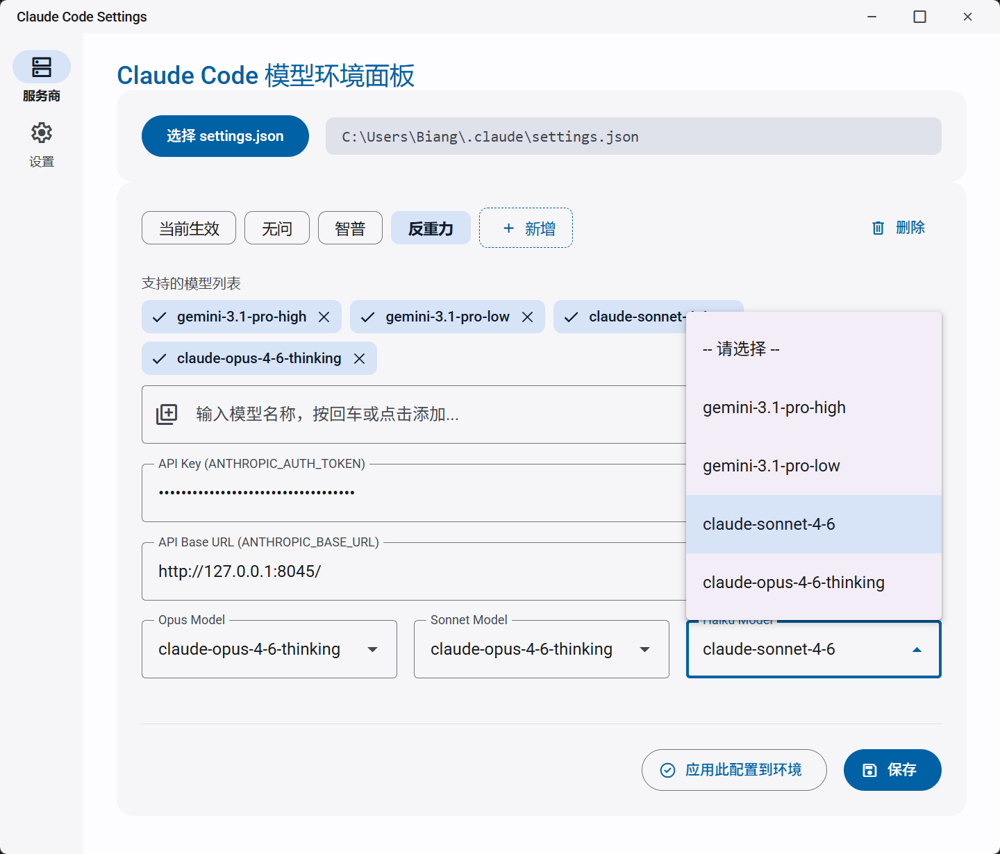
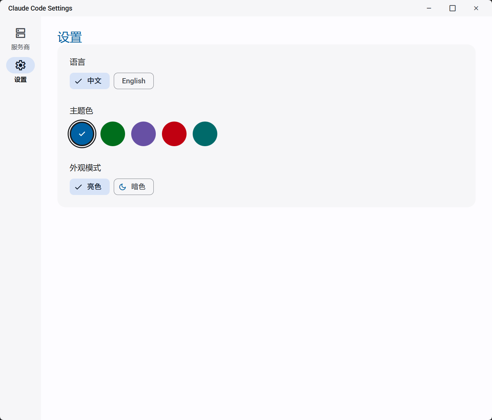

<p align="center">
  
</p>

<h1 align="center">ClaudeSwitch</h1>

<p align="center">
  <strong>Visual Settings Manager for Claude Code CLI</strong><br>
  <em>One-click switching between multiple AI providers. No more manual JSON editing.</em>
</p>

<p align="center">
  <a href="#-features">Features</a> •
  <a href="#-installation">Installation</a> •
  <a href="#-usage">Usage</a> •
  <a href="#-development">Development</a> •
  <a href="#-screenshots">Screenshots</a>
</p>

<p align="center">
  
  
  
  
</p>

---

## 🇺🇸 English

### ❓ The Problem

Claude Code users who switch between different API providers (Anthropic, Azure, Bedrock, or custom proxies) must manually edit `~/.claude/settings.json` — modifying environment variables and configuration fields repeatedly. It's tedious and error-prone.

### ✨ The Solution

**ClaudeSwitch** provides a beautiful visual interface to manage all your provider configurations:

- **🔄 One-Click Switching** — Toggle between providers instantly
- **📊 Multi-Provider Management** — Store unlimited provider configs
- **🛡️ Safe & Simple** — No more JSON syntax errors
- **🚀 Auto-Detection** — Automatically locates your `settings.json`
- **🎨 Modern UI** — Material Design 3 with dark/light themes

### 📦 Installation

Download the latest release for your platform:

| Platform | Download |
|----------|----------|
| Windows | `.exe` (NSIS) or `.msi` |
| Linux | `.deb` or `.AppImage` |
| macOS | `.dmg` |

👉 [Download from Releases](https://github.com/TwitterIsGood/ClaudeCodeSwitch/releases)

### 🚀 Usage

1. **Launch ClaudeSwitch** — It auto-detects your Claude Code config
2. **Add Providers** — Choose from presets (Anthropic, Azure, Bedrock, OpenRouter) or create custom ones
3. **Enter API Key** — Paste your key for each provider
4. **Switch & Apply** — One click to switch providers and apply to environment

### 🛠️ Supported Providers

| Provider | Status | Notes |
|----------|--------|-------|
| Anthropic Official | ✅ | Direct API access |
| Azure OpenAI | ✅ | Azure deployment support |
| AWS Bedrock | ✅ | AWS credentials required |
| OpenRouter | ✅ | Multi-model gateway |
| Custom | ✅ | Any OpenAI-compatible API |

---

## 🇨🇳 简体中文

### ❓ 它解决什么问题？

Claude Code 用户在使用不同 API 服务商（Anthropic 官方、Azure、Bedrock 或自定义代理）时，需要反复手动编辑 `~/.claude/settings.json`——修改环境变量和配置项。既繁琐又容易出错。

### ✨ 解决方案

**ClaudeSwitch** 提供美观的可视化界面来管理所有服务商配置：

- **🔄 一键切换** — 瞬间在不同服务商间切换
- **📊 多服务商管理** — 保存无限数量的服务商配置
- **🛡️ 安全简单** — 再也不用担心 JSON 语法错误
- **🚀 自动检测** — 自动定位你的 `settings.json`
- **🎨 现代界面** — Material Design 3，支持亮/暗主题

### 📦 安装

下载适合你平台的最新版本：

| 平台 | 格式 |
|------|------|
| Windows | `.exe` (NSIS) 或 `.msi` |
| Linux | `.deb` 或 `.AppImage` |
| macOS | `.dmg` |

👉 [从 Releases 下载](https://github.com/TwitterIsGood/ClaudeCodeSwitch/releases)

### 🚀 使用方法

1. **启动 ClaudeSwitch** — 自动检测 Claude Code 配置文件
2. **添加服务商** — 从预设模板选择或创建自定义服务商
3. **输入 API Key** — 粘贴每个服务商的密钥
4. **切换并应用** — 一键切换服务商并应用到环境变量

### 🛠️ 支持的服务商

| 服务商 | 状态 | 备注 |
|--------|------|------|
| Anthropic 官方 | ✅ | 直接 API 访问 |
| Azure OpenAI | ✅ | Azure 部署支持 |
| AWS Bedrock | ✅ | 需要 AWS 凭证 |
| OpenRouter | ✅ | 多模型网关 |
| 自定义 | ✅ | 任何 OpenAI 兼容 API |

---

## 📸 Screenshots / 截图

### Home / 首页
<p align="center">
  
</p>

### Provider Management / 服务商管理
<p align="center">
  
</p>

### Settings / 设置
<p align="center">
  
</p>

---

## 🔧 Development / 开发

### Prerequisites / 前置要求

- Node.js 20+
- Rust (latest stable)
- Platform-specific dependencies

### Quick Start / 快速开始

```bash
# Clone the repository
git clone https://github.com/TwitterIsGood/ClaudeCodeSwitch.git
cd ClaudeCodeSwitch

# Install dependencies
npm install

# Run in development mode
npm run tauri dev

# Build for production
npm run tauri build
```

### Tech Stack / 技术栈

- **Frontend**: React 19 + TypeScript + Vite
- **Backend**: Tauri v2 + Rust
- **UI**: Material Web Components (M3)

---

## 📄 License / 许可证

[MIT License](LICENSE)

---

## 🤝 Contributing / 贡献

Contributions are welcome! Feel free to submit issues or pull requests.

欢迎贡献代码！随时提交 Issue 或 Pull Request。

---

<p align="center">
  Made with ❤️ for the Claude Code community
</p>
